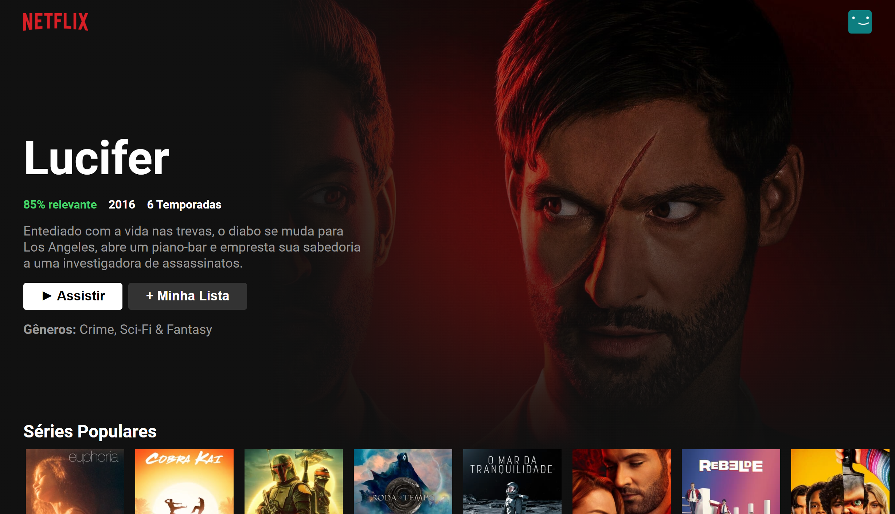
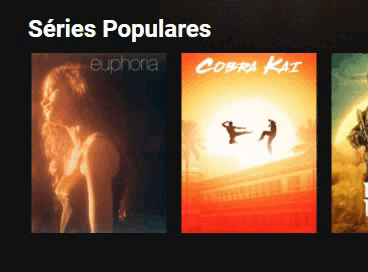
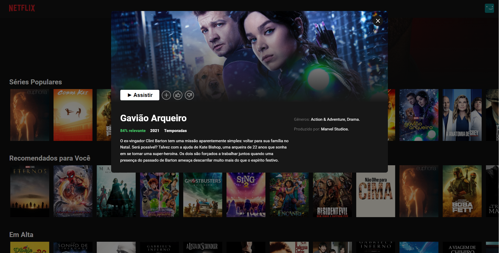
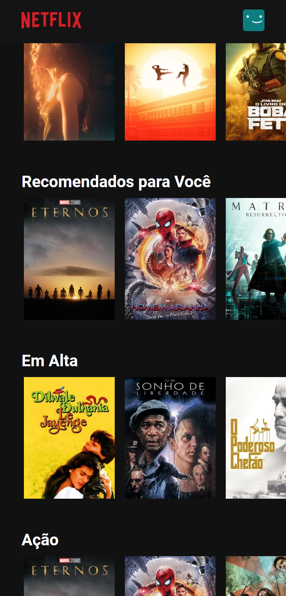
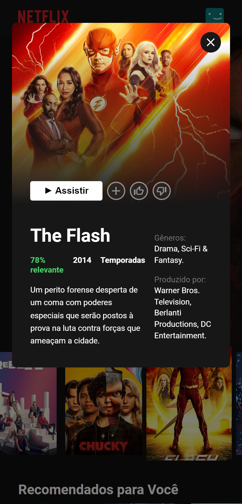

# Netflix Clone - ReactJS
 
 

## 📸 Preview

  

    
  

## 📝 Descrição

Aplicação desenvolvida com ReactJS que simula um clone dos principais layouts e funcionalidades de exibição de dados da Netflix.

## 🚀 Objetivo

Esse projeto foi criado com o objetivo de praticar o desenvolvimento de layouts componentizados usando ReactJS. Além disso, foi possível explorar diferentes técnicas para consumo de APIs externas, no caso do projeto em questão foi utilizado a [The Movie Database](https://www.themoviedb.org/?language=pt-BR) para o consumo de dados relacionados a filmes e séries. 

## ✅ Features Funcionais
- Loading Personalizado
- Lista personalisada
- Listagem de Filmes e Séries de diferentes classificações
- Modal com mais detalhes da série ou filme
- Responsividade para dispositivos móveis

## ❌ Problemas e Limitações
- A API [The Movie Database](https://www.themoviedb.org/?language=pt-BR) utiliza estratégias de bancos não relacionais. Por causa disso, alguns dados podem não serem retornados ao solicitados. Tentei ao máximo amenizar essas situações, mais ainda é possível acontecer.

## 📸 Componente de Listagem (Widescreen)

  

    

  

## 📸 Componente de Listagem (Mobile)

  

## 📸 Visualização Widescreen

  

    
    
  

## 📸 Visualização Mobile

  

    
  
  
  

